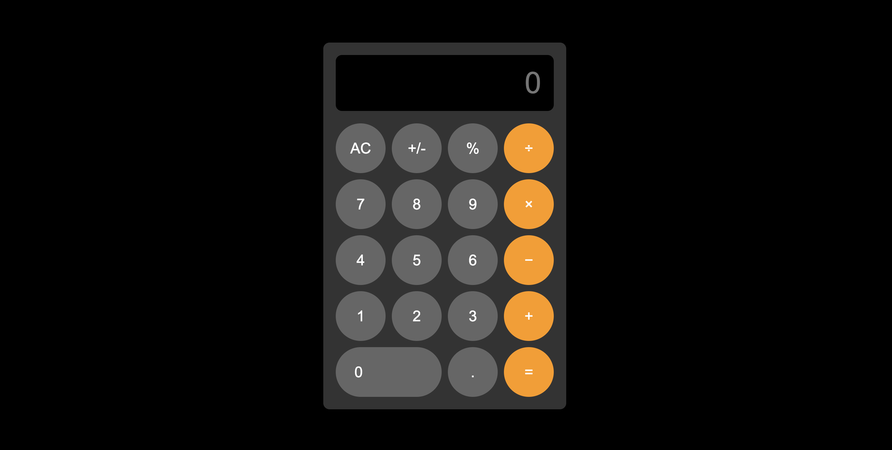

<h1>Simple Calculator Project➗</h1>
 

 
  <h2>Description💫</h2>
  
 * This project implements a basic calculator using HTML, CSS, and JavaScript. 
 * The calculator allows users to perform arithmetic operations including addition, subtraction, multiplication, and division.
 * Additional features include toggling the sign of a number and calculating percentages.
   
  <h2>Features🎨</h2>
  
  - **Clear display**: AC button to reset the calculator.
  - **Toggle number sign**: +/- button to switch between positive and negative.
  - **Percentage calculation**: % button to calculate percentages.
  - **Supports decimals**: Handle decimal numbers in calculations.
  - **Basic arithmetic operations**: Addition, subtraction, multiplication, and division.
  - **Real-time input updates**: Displays the current input dynamically.
   
   <h2>How to Use📌</h2>
   
  1. **Open the Calculator**: Launch the calculator in any modern web browser.
  2. **Input Numbers and Operators**: Click on the buttons to input numbers and select operations.
  3. **Calculate the Result**: Press '=' to compute the result of the expression.
  4. **Reset**: Use 'AC' to clear the display and start fresh.
   
   <h2> Note‼️</h2>
   
 * This project serves as a simple example of DOM manipulation and event handling in JavaScript
# simple-calculator
# simple-calculator
